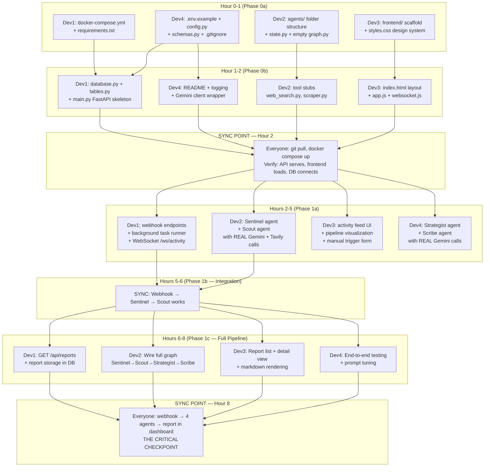

# Phase 0+1 — Parallel Implementation Plan (Hours 0–8)

## Dependency Graph



---

## Phase 0a — Scaffold (Hour 0–1)

### Dev 1 — Infrastructure

| File | What to Build |
|------|--------------|
| `docker-compose.yml` | PostgreSQL (port 5432) + Redis (port 6379) with health checks, named volumes |
| `requirements.txt` | All Python deps (FastAPI, LangGraph, Tavily, asyncpg, redis, etc.) |

**Done when:** `docker compose up -d` starts both services, `pip install -r requirements.txt` works.

### Dev 2 — Agent Structure

| File | What to Build |
|------|--------------|
| `backend/agents/state.py` | `PipelineState(TypedDict)` with all fields agents will share |
| `backend/agents/graph.py` | Empty `StateGraph` with 5 nodes (sentinel, scout, strategist, arbiter, scribe) + edges. Each node is a passthrough stub. |
| `backend/agents/__init__.py` | Exports |

**Done when:** `python -c "from backend.agents.graph import build_graph; g = build_graph(); print('OK')"` works.

### Dev 3 — Frontend Scaffold

| File | What to Build |
|------|--------------|
| `frontend/index.html` | Dashboard shell: sidebar nav + main content area + header |
| `frontend/css/styles.css` | Full design system: CSS variables (colors, fonts, spacing), dark mode, card styles, animations, layout grid |

**Done when:** Open `frontend/index.html` in browser → see a dark-themed dashboard skeleton.

### Dev 4 — Config & Schemas

| File | What to Build |
|------|--------------|
| `.env.example` | All env vars with placeholder values |
| `.gitignore` | Python, Node, .env, __pycache__, .venv, etc. |
| `backend/config.py` | Pydantic `Settings` class loading from `.env` |
| `backend/models/schemas.py` | All Pydantic output models: `SignalInput`, `SentinelOutput`, `ResearchOutput`, `AnalysisOutput`, `ValidationResult`, `ReportOutput` |

**Done when:** `python -c "from backend.config import settings; print(settings.GEMINI_API_KEY[:5])"` works.

---

## Phase 0b — Core Wiring (Hour 1–2)

### Dev 1 — Database + FastAPI

| File | What to Build |
|------|--------------|
| `backend/models/database.py` | Async SQLAlchemy engine + session factory |
| `backend/models/tables.py` | Tables: `webhooks`, `workflows`, `reports`, `competitors` |
| `backend/main.py` | FastAPI app with CORS, lifespan (DB init), `GET /health` |

**Done when:** `uvicorn backend.main:app` starts, `curl localhost:8000/health` returns `{"status": "ok"}`.

### Dev 2 — Tool Stubs

| File | What to Build |
|------|--------------|
| `backend/agents/tools/web_search.py` | Tavily wrapper: `async def search_web(query, max_results=5) -> list[SearchResult]` |
| `backend/agents/tools/url_scraper.py` | httpx + BeautifulSoup: `async def scrape_url(url) -> str` |
| `backend/agents/tools/__init__.py` | Exports |

**Done when:** `python -c "from backend.agents.tools.web_search import search_web; import asyncio; print(asyncio.run(search_web('test')))"` returns real Tavily results.

### Dev 3 — Frontend Core JS

| File | What to Build |
|------|--------------|
| `frontend/js/app.js` | Main app: page routing (hash-based), initialization |
| `frontend/js/websocket.js` | WebSocket client that connects to `ws://localhost:8000/ws/activity`, renders events to activity feed |
| `frontend/js/pipeline.js` | Pipeline visualization: 5 nodes (Sentinel→Scout→Strategist→Arbiter→Scribe) with status colors (idle/active/done/error) |

**Done when:** Dashboard loads, pipeline visualization shows 5 nodes, WebSocket attempts connection (will fail until backend is ready — that's fine).

### Dev 4 — Utilities

| File | What to Build |
|------|--------------|
| `backend/services/llm.py` | Gemini client wrapper: `async def generate(prompt, response_schema=None) -> str` with structured output support |
| `backend/services/logger.py` | Structured logging setup (JSON format, per-agent context) |
| `README.md` | Quickstart guide: clone → env → docker → run |

**Done when:** `python -c "from backend.services.llm import generate; import asyncio; print(asyncio.run(generate('Say hello')))"` returns Gemini response.

---

## 🔴 SYNC POINT — Hour 2

**Everyone stops. Everyone pulls. Everyone verifies:**

```bash
git pull origin main
docker compose up -d
source .venv/bin/activate
pip install -r requirements.txt
uvicorn backend.main:app --port 8000 &
python3 -m http.server 3000 --directory frontend &

# Verify:
curl http://localhost:8000/health          # → {"status": "ok"}
# Open http://localhost:3000               # → Dashboard loads
# Check Docker: postgres + redis running
```

**If anything fails, ALL 4 DEVS fix it together before moving on.**

---

## Phase 1a — Core Agents + Endpoints (Hours 2–5)

### Dev 1 — API Layer

| File | What to Build |
|------|--------------|
| `backend/api/webhooks.py` | `POST /webhooks/news` — receive payload, store in DB, trigger pipeline as background task |
| `backend/api/analyze.py` | `POST /api/analyze` — manual trigger, same pipeline |
| `backend/api/websocket.py` | `WebSocket /ws/activity` — subscribe to Redis pub/sub, stream events to frontend |
| `backend/api/reports.py` | `GET /api/reports` (list), `GET /api/reports/{id}` (detail) — stub returning empty for now |
| `backend/services/events.py` | Redis pub/sub helper: `publish_event(event_type, data)` — used by agents to broadcast activity |

**Done when:** `curl -X POST localhost:8000/webhooks/news -H "Content-Type: application/json" -d '{"title":"test"}'` returns 202 and triggers a background task. WebSocket at `/ws/activity` streams events.

### Dev 2 — Sentinel + Scout Agents

| File | What to Build |
|------|--------------|
| `backend/agents/sentinel.py` | Takes raw signal → LLM scores relevance (0-1) → extracts entities (company, event_type, market) → decides proceed/skip. Publishes activity events via Redis. |
| `backend/agents/scout.py` | Takes sentinel output → generates 3-5 search queries → calls Tavily for each → optionally scrapes top URLs → structures findings into `ResearchOutput`. Publishes activity events. |

**Key details:**
- Both agents use `backend/services/llm.py` for Gemini calls
- Both agents use structured output (`response_schema` parameter)
- Both publish events: `publish_event("agent_activity", {"agent": "sentinel", "status": "running", "detail": "..."})`
- Scout must handle Tavily failures gracefully (try/except, return partial results)

**Done when:** Feed a news signal → Sentinel scores it → Scout produces structured research with real web sources.

### Dev 3 — Dashboard Interactive Features

| File | What to Build |
|------|--------------|
| `frontend/js/activity.js` | Real-time activity feed: receives WebSocket events, renders as timestamped cards with agent name, status, and detail |
| `frontend/js/reports.js` | Report list view (fetch from API) + report detail view (render markdown with marked.js) |
| Update `frontend/index.html` | Manual trigger form: competitor name + question → POST to `/api/analyze` |
| Update `frontend/css/styles.css` | Activity feed animations (slide-in), status badges, form styling |

**Done when:** Submit manual trigger → see activity events stream in real-time on dashboard. Report list shows entries (even if empty for now).

### Dev 4 — Strategist + Scribe Agents

| File | What to Build |
|------|--------------|
| `backend/agents/strategist.py` | Takes `ResearchOutput` → deep analysis: competitive impact, market positioning, strategic implications, SWOT-style assessment. Output: `AnalysisOutput` with structured sections. |
| `backend/agents/scribe.py` | Takes validated `AnalysisOutput` → generates formatted markdown report: executive summary, detailed analysis, data tables, source citations, confidence scores. Stores report in DB. |

**Key details:**
- Strategist prompt must encourage **deep reasoning** — chain-of-thought, considering multiple angles
- Scribe produces clean, professional markdown (not raw LLM dump)
- Both publish activity events via Redis

**Done when:** Feed an `AnalysisOutput` → Scribe produces a polished markdown report string.

---

## 🔴 SYNC POINT — Hour 5–6

**Integration test: Webhook → Sentinel → Scout must work end-to-end.**

```bash
# Dev 1 + Dev 2 pair up:
curl -X POST http://localhost:8000/webhooks/news \
  -H "Content-Type: application/json" \
  -d '{
    "title": "NVIDIA announces new AI chip surpassing H100",
    "source": "TechCrunch",
    "url": "https://techcrunch.com/example",
    "published_at": "2026-05-15T08:00:00Z"
  }'

# Expected: 
# 1. Webhook stored in DB
# 2. Sentinel scores relevance → high
# 3. Scout searches web → structured research output
# 4. Activity events visible in dashboard WebSocket feed
```

**Dev 3 + Dev 4:** While integration happens, Dev 3 polishes UI, Dev 4 tests Strategist + Scribe in isolation.

---

## Phase 1c — Full Pipeline (Hours 6–8)

### Dev 1 — Report Storage API

| Task | Detail |
|------|--------|
| Implement `GET /api/reports` | Query DB, return list of completed reports with metadata |
| Implement `GET /api/reports/{id}` | Return full report content (markdown + metadata) |
| Store reports | When Scribe completes, save to `reports` table |

### Dev 2 — Wire the Complete Graph

| Task | Detail |
|------|--------|
| Update `graph.py` | Replace stubs with real agents: Sentinel → Scout → Strategist → Scribe (skip Arbiter for now, Phase 2) |
| Add conditional edge | After Sentinel: if relevance < 0.4, skip to "done" (don't waste tokens on noise) |
| Connect to webhook endpoint | `POST /webhooks/news` → `graph.ainvoke(state)` |

### Dev 3 — Report Display

| Task | Detail |
|------|--------|
| Report list | Fetch from `GET /api/reports`, render as cards (title, date, confidence, competitor) |
| Report detail | Click a card → render full markdown report using marked.js |
| Include CDN | Add `<script src="marked.min.js">` to index.html |

### Dev 4 — End-to-End Validation

| Task | Detail |
|------|--------|
| Test 3 different scenarios | 1) High-relevance news → full report. 2) Low-relevance news → filtered out. 3) Manual trigger with custom question. |
| Tune prompts | Adjust agent system prompts based on output quality |
| Fix bugs | Coordinate with other devs on integration issues |

---

## 🔴 CRITICAL CHECKPOINT — Hour 8

**The entire pipeline must work:**

```
Webhook → Sentinel (filter) → Scout (research) → Strategist (analyze) → Scribe (report) → Dashboard shows report
```

**Test command:**
```bash
curl -X POST http://localhost:8000/webhooks/news \
  -H "Content-Type: application/json" \
  -d '{
    "title": "OpenAI launches GPT-5 with 10x performance gains",
    "source": "The Verge", 
    "url": "https://theverge.com/example",
    "published_at": "2026-05-15T10:00:00Z"
  }'

# Then open dashboard → watch agents work → report appears
```

> [!CAUTION]
> **If this doesn't work by Hour 8, STOP everything else and fix it.** Phases 2-5 are all enhancements on top of this core flow. Without it, there is no product.

---

## File Ownership Summary

| Dev | Files Owned |
|-----|------------|
| **Dev 1** | `docker-compose.yml`, `requirements.txt`, `backend/main.py`, `backend/models/database.py`, `backend/models/tables.py`, `backend/api/webhooks.py`, `backend/api/analyze.py`, `backend/api/reports.py`, `backend/api/websocket.py`, `backend/services/events.py` |
| **Dev 2** | `backend/agents/state.py`, `backend/agents/graph.py`, `backend/agents/sentinel.py`, `backend/agents/scout.py`, `backend/agents/tools/web_search.py`, `backend/agents/tools/url_scraper.py` |
| **Dev 3** | `frontend/index.html`, `frontend/css/styles.css`, `frontend/js/app.js`, `frontend/js/websocket.js`, `frontend/js/pipeline.js`, `frontend/js/activity.js`, `frontend/js/reports.js` |
| **Dev 4** | `.env.example`, `.gitignore`, `README.md`, `backend/config.py`, `backend/models/schemas.py`, `backend/services/llm.py`, `backend/services/logger.py`, `backend/agents/strategist.py`, `backend/agents/scribe.py` |

**Rule: No two devs edit the same file.** If you need something from another dev's file, communicate and agree on the interface first.
