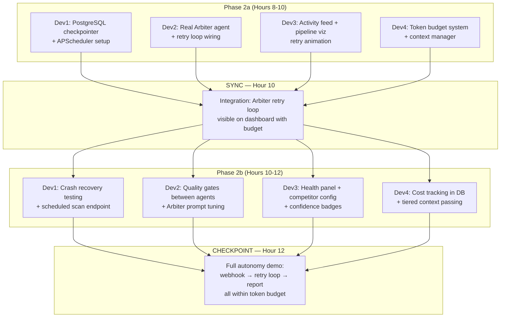

# Phase 2 — Autonomy & Reliability (Hours 8–12)

**Goal:** The system becomes genuinely autonomous — it validates its own work, retries intelligently, recovers from crashes, and manages costs.

> [!IMPORTANT]
> **Prerequisite:** Phase 1 checkpoint MUST pass before starting Phase 2. The full pipeline (Webhook → Sentinel → Scout → Strategist → Scribe → Report in DB) must work end-to-end.

---

## What Phase 2 Adds

| Capability | Before (Phase 1) | After (Phase 2) |
|-----------|------------------|-----------------|
| **Validation** | Arbiter auto-approves everything | Arbiter cross-references claims against evidence, rejects low-confidence analyses |
| **Retry Logic** | None — one-shot pipeline | Semantic retry: Arbiter sends Scout back with different search terms (up to 3x) |
| **Crash Recovery** | Process dies = lost work | LangGraph + PostgreSQL checkpointing — resume from last agent |
| **Cost Control** | Unlimited token spend | Per-agent and per-workflow token budget with graceful stop |
| **Scheduling** | Manual triggers only | APScheduler: automatic periodic scans for tracked competitors |
| **Context Management** | Raw state passed between agents | Tiered: summarize prior outputs to stay within token limits |
| **Dashboard** | Static pipeline display | Real-time retry loops visible, confidence scores, health panel |

---

## Dependency Graph



---

## Phase 2a — Core Autonomy (Hours 8–10)

### Dev 1 — Crash Recovery & Scheduling

| File | What to Build |
|------|--------------|
| Update `backend/services/background.py` | Integrate LangGraph PostgreSQL checkpointer so pipeline state is persisted after each agent completes |
| `backend/services/scheduler.py` [NEW] | APScheduler setup: periodic competitive scan every N minutes for tracked competitors. Calls `POST /webhooks/scheduled` internally |
| Update `backend/models/tables.py` | Add `competitors` table (id, name, industry, keywords, active, created_at) for scheduled scans |
| `backend/api/competitors.py` [NEW] | CRUD endpoints: `GET /api/competitors`, `POST /api/competitors`, `DELETE /api/competitors/{id}` |
| Update `backend/main.py` | Register competitor router + start scheduler on startup |

**Key details:**
- Use `langgraph-checkpoint-postgres` (already in requirements.txt)
- Checkpointer config: `PostgresSaver.from_conn_string(DATABASE_URL_SYNC)`
- Pass the checkpointer to `build_graph()` via `builder.compile(checkpointer=checkpointer)`
- Scheduler should read from `competitors` table and generate signals for each active competitor

**Done when:** Kill the uvicorn process mid-pipeline → restart → pipeline resumes from the last completed agent. Scheduler fires a scan every 5 minutes.

---

### Dev 2 — Real Arbiter Agent + Retry Wiring

| File | What to Build |
|------|--------------|
| `backend/agents/arbiter.py` [NEW] | Real Arbiter agent: takes `AnalysisOutput` + `ResearchOutput`, cross-references claims against evidence, scores confidence per claim, decides approve/reject |
| Update `backend/agents/graph.py` | Replace arbiter stub with real import. Verify retry loop: Arbiter rejects → increments `retry_count` → Scout re-runs with `retry_with_queries` |
| Update `backend/agents/scout.py` | Ensure Scout reads `validation_result.retry_with_queries` and uses them instead of generating new queries on retry |

**Key details:**
- Arbiter system prompt should:
  1. List each major claim from `AnalysisOutput`
  2. Check if `ResearchOutput.key_findings` contains supporting evidence
  3. If < 60% of claims are supported → reject with `retry_with_queries` (new search angles)
  4. `retry_with_queries` should be DIFFERENT from Scout's original queries
- Max 3 retries (already wired in `should_retry_or_proceed`)
- On the 3rd retry, auto-approve with low confidence (don't loop forever)
- Use `generate_structured` with `ValidationResult` schema, `max_output_tokens=8192`

**Done when:** Feed a vague signal → Arbiter rejects first analysis → Scout re-researches with different queries → Arbiter approves on retry #2 with higher confidence.

---

### Dev 3 — Dashboard Real-Time Features

| File | What to Build |
|------|--------------|
| `frontend/js/activity.js` [NEW] | Real-time activity feed: receive WebSocket events → render timestamped cards with agent name, status badge (running/done/error), detail text. Auto-scroll to latest. |
| Update `frontend/js/pipeline.js` | Animate retry loops: when Arbiter sends back to Scout, show the arrow reversing. Color codes: idle=gray, running=blue pulse, done=green, error=red, retry=orange |
| `frontend/js/reports.js` [NEW] | Report list: fetch `GET /api/reports` → render as cards. Report detail: click card → render markdown with marked.js. Add `<script src="https://cdn.jsdelivr.net/npm/marked/marked.min.js">` to index.html |
| Update `frontend/index.html` | Add manual trigger form (competitor name + question → POST to `/api/analyze`). Add marked.js CDN link. |
| Update `frontend/css/styles.css` | Activity feed animations (slide-in), retry pulse animation, status badges, form styling |

**Key details:**
- WebSocket URL: `ws://localhost:8000/ws/activity`
- Events come as: `{"type": "activity", "payload": {"agent": "scout", "status": "running", "message": "..."}}`
- Pipeline viz should have 5 nodes in a horizontal row with arrows between them
- Retry should show a curved arrow from Arbiter back to Scout
- Use CSS `@keyframes` for the pulse animation on active agents

**Done when:** Submit a webhook → watch all 5 agents animate in sequence. If Arbiter retries, see the animation loop back. Activity feed shows every step in real-time.

---

### Dev 4 — Token Budget & Context Management

| File | What to Build |
|------|--------------|
| `backend/services/budget.py` [NEW] | Token budget tracker: `class TokenBudget` with `track(agent, tokens)`, `check_remaining()`, `is_exceeded()`. Reads limits from `settings.MAX_TOKENS_PER_WORKFLOW` |
| `backend/services/context.py` [NEW] | Tiered context manager: `summarize_for_next_agent(state, target_agent)` — compresses prior agent outputs to fit within token window. Uses LLM to summarize long research/analysis before passing to next agent |
| Update `backend/agents/state.py` | Add `token_budget` field to `PipelineState` |
| Update `backend/services/llm.py` | Track tokens per call. Return token count alongside generated text. Integrate with budget tracker |
| Update `backend/models/tables.py` | Add `tokens_used` and `estimated_cost` columns to `workflows` table |

**Key details:**
- Budget defaults: `MAX_TOKENS_PER_WORKFLOW = 500,000`, `MAX_COST_PER_WORKFLOW = $2.00`
- Each agent checks budget before calling LLM. If exceeded → return early with warning
- Context manager tiers:
  - **Tier 1 (< 50% budget):** Pass full state
  - **Tier 2 (50-80% budget):** Summarize research to key findings only
  - **Tier 3 (> 80% budget):** One-paragraph summary of everything
- Token tracking should be logged via structured logger

**Done when:** Run a pipeline with `MAX_TOKENS_PER_WORKFLOW=10000` (artificially low) → pipeline stops mid-way with "budget exceeded" message instead of crashing.

---

## 🔴 SYNC POINT — Hour 10

**Everyone stops. Everyone pulls. Integration test:**

```bash
git pull origin main
pip install -r requirements.txt

# Restart server
kill $(lsof -t -i:8000)
uvicorn backend.main:app --reload --port 8000

# Test 1: Normal pipeline (should complete)
curl -X POST http://localhost:8000/webhooks/news \
  -H "Content-Type: application/json" \
  -d '{"title":"Meta launches new open-source LLM with 1T parameters","source":"TechCrunch"}'

# Wait 60s, then check:
curl -s http://localhost:8000/api/reports | python3 -m json.tool

# Test 2: Open dashboard (http://localhost:3000)
# → Should see activity feed + pipeline viz animating

# Test 3: Check token tracking
curl -s http://localhost:8000/api/reports | python3 -c "
import json,sys
data = json.load(sys.stdin)
if data:
    print(f'Latest report: {data[0][\"title\"][:60]}')
    print(f'Confidence: {data[0][\"confidence_score\"]}')
    print(f'Sources: {len(data[0][\"sources\"])}')
"
```

**If Arbiter retry loop or budget system doesn't work, Dev 2 + Dev 4 pair up to fix it before Phase 2b.**

---

## Phase 2b — Hardening (Hours 10–12)

### Dev 1 — Crash Recovery Testing + Scheduled Scans

| Task | Detail |
|------|--------|
| Crash recovery test | Start a pipeline, `kill -9` the uvicorn process mid-Scout, restart, verify pipeline resumes from Scout (not from Sentinel) |
| Scheduled scan wiring | APScheduler reads `competitors` table → generates `SignalInput` for each → calls `dispatch_pipeline` |
| Graceful degradation | If Redis is down, WebSocket events fail silently (don't crash the pipeline). If Postgres is down, return 503. |

### Dev 2 — Quality Gates + Prompt Tuning

| Task | Detail |
|------|--------|
| Quality gate: Sentinel → Scout | If `relevance_score < 0.4`, skip Scout entirely (already wired, verify it works) |
| Quality gate: Scout → Strategist | If `sources_consulted == 0`, skip Strategist and return "insufficient data" report |
| Arbiter prompt tuning | Test with 3 different signals: 1) High-relevance news → should approve. 2) Vague signal → should retry. 3) Low-relevance noise → should skip at Sentinel. Tune prompts until all 3 produce correct behavior |
| Update `graph.py` | Add the Scout → Strategist quality gate as a conditional edge |

### Dev 3 — Health Panel + Competitor Config

| Task | Detail |
|------|--------|
| System health panel | New section on dashboard: active workflows count, recent completions (last 5), total reports generated. Poll `GET /api/health/stats` every 10 seconds |
| Competitor configuration | Simple UI: text input + "Add" button → POST to `/api/competitors`. List of tracked competitors with "Remove" button |
| Confidence badges | On report cards, show confidence as a colored badge: green (>0.8), yellow (0.5-0.8), red (<0.5) |
| Report rendering | Use marked.js to render `full_report_markdown` as HTML in the detail view |

### Dev 4 — Cost Tracking + Context Optimization

| Task | Detail |
|------|--------|
| Cost tracking API | `GET /api/health/stats` → returns `{"active_workflows": N, "total_reports": N, "total_tokens": N, "estimated_cost": "$X.XX"}` |
| Persist token usage | After each pipeline run, update the `workflows` table with `tokens_used` and `estimated_cost` |
| Context compression | Before Strategist runs, if total state > 50k tokens, LLM-summarize the research into 2000 chars. Before Scribe runs, summarize analysis similarly |
| Test with multiple signals | Run 5 different signals back-to-back. Verify no memory leaks, no state corruption, costs tracked correctly |

---

## 🔴 CRITICAL CHECKPOINT — Hour 12

**Full autonomy must be demonstrated:**

```
1. Webhook arrives → Sentinel filters (autonomous decision)
2. Scout researches (real web search, parallel queries)
3. Strategist analyzes (deep reasoning, structured output)
4. Arbiter validates → REJECTS → Scout re-researches with DIFFERENT queries
5. Arbiter approves on retry → Scribe generates report
6. All within token budget, all state checkpointed
7. Dashboard shows the entire flow in real-time
```

**Test the retry loop explicitly:**
```bash
# Send a vague signal that should trigger a retry
curl -X POST http://localhost:8000/webhooks/news \
  -H "Content-Type: application/json" \
  -d '{"title":"Something is happening in the AI chip market","source":"anonymous"}'

# Watch the dashboard — Arbiter should reject and Scout should re-research
```

---

## File Ownership Summary (Phase 2)

| Dev | Files Owned |
|-----|------------|
| **Dev 1** | `backend/services/scheduler.py` [NEW], `backend/api/competitors.py` [NEW], updates to `background.py`, `tables.py`, `main.py` |
| **Dev 2** | `backend/agents/arbiter.py` [NEW], updates to `graph.py`, `scout.py` |
| **Dev 3** | `frontend/js/activity.js` [NEW], `frontend/js/reports.js` [NEW], updates to `pipeline.js`, `index.html`, `styles.css` |
| **Dev 4** | `backend/services/budget.py` [NEW], `backend/services/context.py` [NEW], updates to `llm.py`, `state.py`, `tables.py` |

> [!WARNING]
> **Dev 1 and Dev 4 both touch `tables.py`.** Coordinate: Dev 1 adds the `competitors` table, Dev 4 adds `tokens_used`/`estimated_cost` columns to the `workflows` table. Don't overlap.

**Rule: No two devs edit the same file without coordinating first.**