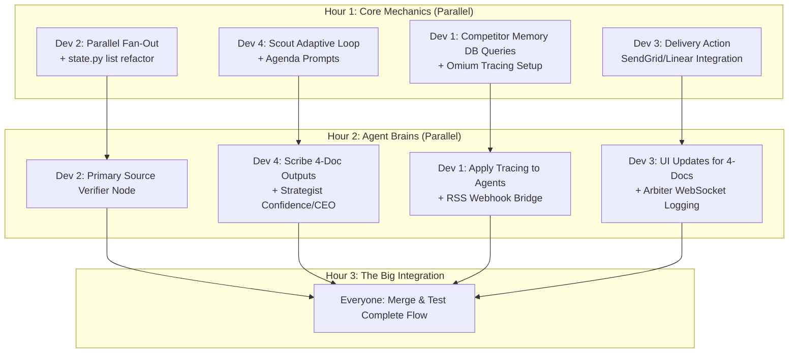

# Phase 3 — The Analyst-Parity Parallel Execution Plan

This is the battle plan for the final sprint. We are dividing the 11 critical features across 4 developers to aggressively parallelize work, avoid merge conflicts, and win this hackathon.

## Dependency Graph

---

## Dev 1: Infrastructure & Observability
**Goal:** Prove the system remembers context, reacts to the real world, and is highly observable.

| Task | Files Owned | Details |
|------|-------------|---------|
| **Historical Memory** | `backend/services/context.py` | Write a helper `get_competitor_history(competitor)` that does `SELECT * FROM reports WHERE...` for the last 3 runs. Expose this for Dev 4 to use. |
| **Omium Tracing** | `requirements.txt`, all agents | Wrap `sentinel_node`, `scout_node`, etc. in `with tracer.start_span()`. Pass parent IDs so the dashboard shows the fan-out tree. |
| **Real Webhook** | Make.com (UI), `backend/api/webhooks.py` | Configure an RSS to Webhook bridge on Make.com hitting our ngrok. Ensure FastAPI parses the payload correctly. |

---

## Dev 2: LangGraph Orchestration
**Goal:** Build the complex async map-reduce graph and primary verification step.

| Task | Files Owned | Details |
|------|-------------|---------|
| **Parallel Fan-Out** | `backend/agents/graph.py`, `backend/agents/state.py` | Update `research_output` to `Annotated[list[ResearchOutput], operator.add]`. Modify Sentinel conditional edge to return `[Send("scout", {"angle": a})]` for 3 distinct angles. |
| **Primary Verifier** | `backend/agents/verifier.py`, `graph.py` | Create a new node *before* Scout. Use Tavily/Scraper to hit company blogs/LinkedIn. If fake, halt pipeline (`should_continue=False`). |

---

## Dev 3: Frontend & External Side-Effects
**Goal:** Make the demo visually undeniable and prove external utility.

| Task | Files Owned | Details |
|------|-------------|---------|
| **Real Delivery Action** | `backend/services/delivery.py` (New) | Pick ONE: SendGrid API to email the CEO brief, or Linear API to create an engineering ticket. Hook this up to the end of the pipeline. |
| **4-Doc UI** | `frontend/index.html`, `frontend/js/reports.js` | When Scribe finishes, don't just show one markdown blob. Create 4 tabs: "Exec", "Tech", "Sales", "Risk". |
| **Arbiter Rejection UI**| `frontend/js/activity.js` | Add a loud, red visual alert to the activity feed when the Arbiter publishes a rejection event. |

---

## Dev 4: LLM Brains (Prompts & Schemas)
**Goal:** Elevate the AI from a search script to a Senior Analyst.

| Task | Files Owned | Details |
|------|-------------|---------|
| **Adaptive Scout** | `backend/agents/scout.py`, `models/schemas.py` | Build the inner `while` loop. Add `CoverageEvaluation` schema. If confidence < 0.75, LLM generates missing questions, loop repeats. |
| **Agenda Generation**| `backend/agents/scout.py` | Rewrite initial prompt to generate strategic questions (Pricing, Team, Build vs Buy) instead of headline variations. |
| **Analyst Outputs** | `models/schemas.py`, `backend/agents/scribe.py`, `strategist.py` | Update `ReportOutput` to hold 4 distinct strings. Add `CONFIRMED/INFERRED/SPECULATIVE` enums and `ceo_questions` to `AnalysisOutput`. |

---

## 🚦 Coordination Rules
1. **Dev 2 & Dev 4** both touch `scout.py` and `state.py`. Dev 2 is wrapping it in `Send` logic, Dev 4 is writing the inner while loop. **Communicate on the input/output schema before coding.**
2. **Dev 1 & Dev 4** both touch Context. Dev 1 writes the SQL query, Dev 4 injects the result into the Strategist prompt.

## User Review Required
If this parallel allocation looks good to you and your team, I will start executing **Dev 2 and Dev 4's tasks** (the core LangGraph Fan-Out and Adaptive Scout loops) while you assign Dev 1 and Dev 3 tasks to the rest of the team!
