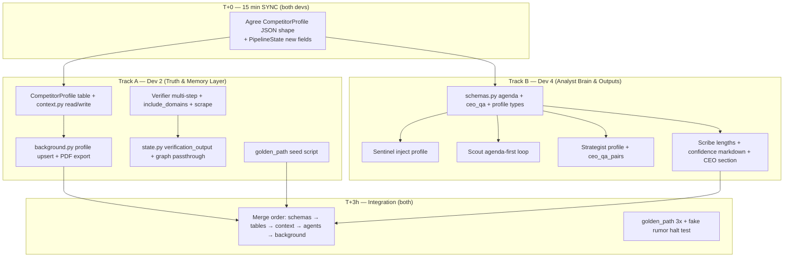

# Phase 4 — Column 4 Analyst Parity (2-Dev Parallel Sprint)

**Team:** Dev 2 + Dev 4 only (Dev 1 & Dev 3 sleeping)  
**Goal:** After both branches merge, ASCENT is **fully Column 4** — not “orchestrated search,” but **analyst-grade** verification, memory, agenda, outputs, and demo reliability.

**Timebox:** ~6 hours wall clock (3h parallel + 1h integration + 2h hardening/demo)

---

## Column 4 Definition of Done (Non-Negotiable)

Use this checklist at merge. **All boxes must be green** before you call Phase 4 done.

| # | Requirement | How to prove |
|---|-------------|--------------|
| C1 | **Skeptical primary verification** — official domain, signal URL, product existence, optional SEC | Feed fake rumor → pipeline **halts at Verifier** with reason. Feed real PR + blog → proceeds. |
| C2 | **Institutional competitor memory** — structured profile **written after every successful run**, read before Sentinel + Strategist | Run pipeline twice on same competitor → Strategist prompt includes prior `shipping_record`, `launch_history`, `hiring_signals`. |
| C3 | **Research agenda first** — Scout outputs 5 analyst questions *then* searches to answer them | Logs show `scout_agenda_generated` before searches; queries map 1:1 to agenda items. |
| C4 | **Four stakeholder briefs** with enforced shape | Exec ≤220 words + one decision; Tech ~500 words; Sales bullets; Risk table. UI tabs show distinct content. |
| C5 | **Per-claim confidence in final docs** | Scribe renders `CONFIRMED` / `INFERRED` / `SPECULATIVE` visually (not just JSON). |
| C6 | **CEO meeting prep** — 5 Q&A pairs with pre-written answers | Exec brief ends with `## Likely CEO Questions` — question + answer + confidence each. |
| C7 | **Golden path demo** works 3/3 runs | `demo/fixtures/golden_path.py` + seeded DB competitor with 2 fake prior launches that “slipped.” |
| C8 | **Verifiable side-effect** | PDF written to disk OR SendGrid sends exec brief (configured). |

---

## Architecture After Phase 4

```
Signal (RSS / manual)
    │
    ▼
Sentinel  ← reads CompetitorProfile from Postgres
    │
    ▼
Verifier  ← 4-step primary check (skeptical, fail-closed on fake)
    │
    ▼
Scout × N  ← agenda (5 questions) → parallel searches → adaptive loop
    │
    ▼
Strategist  ← profile + research → insights + ceo_qa_pairs
    │
    ▼
Arbiter
    │
    ▼
Scribe  ← 4 briefs + confidence rendering + CEO Q&A section
    │
    ▼
Profile Writer  ← upserts CompetitorProfile (Dev 2 hook in background)
    │
    ▼
PDF / SendGrid
```

---

## Parallel Dependency Graph



---

## File Ownership (Avoid Merge Hell)

| File / area | Owner | Other dev |
|-------------|-------|-----------|
| `backend/models/tables.py` | **Dev 2** | Do not touch |
| `backend/models/schemas.py` | **Dev 4** | Do not touch |
| `backend/agents/state.py` | **Dev 2** | Dev 4: request fields in sync only |
| `backend/services/context.py` | **Dev 2** (add `get/write_competitor_profile`) | Dev 4 imports only |
| `backend/agents/verifier.py` | **Dev 2** | — |
| `backend/agents/graph.py` | **Dev 2** | — |
| `backend/agents/tools/web_search.py` | **Dev 2** | — |
| `backend/services/background.py` | **Dev 2** | — |
| `backend/services/delivery.py` + `pdf_generator.py` (new) | **Dev 2** | — |
| `backend/agents/sentinel.py` | **Dev 4** | — |
| `backend/agents/scout.py` | **Dev 4** | — |
| `backend/agents/strategist.py` | **Dev 4** | — |
| `backend/agents/scribe.py` | **Dev 4** | — |
| `backend/agents/arbiter.py` | **Dev 4** (minor: pass insight types in validation prompt) | — |
| `demo/fixtures/golden_path.py` | **Dev 2** seeds DB | **Dev 4** validates output assertions |
| `tests/test_phase4_column4.py` | **Split** — Dev 2: verifier+profile, Dev 4: agenda+scribe | |

**Forbidden overlap:** Neither dev edits `scout.py` and `verifier.py`. Neither dev edits both `tables.py` and `schemas.py`.

---

## T+0 Contract (15 minutes — do this before coding)

Paste this into Slack/doc and both agree:

### `CompetitorProfile` (Postgres JSON column or dedicated columns)

```json
{
  "competitor_name": "Acme Corp",
  "shipping_record": "Announced 3 major features since 2022; avg 14mo slip to GA",
  "launch_history": [
    {"product": "Acme AI Suite", "announced": "2024-03", "shipped": "2025-01", "notes": "6mo late"}
  ],
  "hiring_signals": ["40 ML engineers Q1 2025 — telegraphed AI platform"],
  "ceo_public_statements": ["CEO at SaaStr: 'enterprise AI is our 2025 bet'"],
  "last_assessment": "Overhype pattern on launches; technical depth unclear",
  "updated_at": "2026-05-16T12:00:00Z"
}
```

### New `PipelineState` fields (Dev 2 adds)

```python
verification_output: Annotated[Optional[VerificationOutput], _replace]  # Dev 4 defines model in schemas
competitor_profile: Annotated[Optional[CompetitorProfile], _replace]   # loaded at pipeline start
```

### New schemas (Dev 4 adds in `schemas.py`)

- `VerificationOutput` — `is_verified`, `checks: list[VerificationCheck]`, `reasoning`
- `VerificationCheck` — `source_type` (official_blog | signal_url | product_page | linkedin | sec), `passed`, `url`, `evidence`
- `ResearchQuestion` — `question`, `why_it_matters`, `priority`
- `ResearchAgenda` — `questions: list[ResearchQuestion]`
- `CeoQaPair` — `question`, `answer`, `confidence` (InsightType or float)
- `AnalysisOutput` — add `ceo_qa_pairs: list[CeoQaPair]` (keep `ceo_questions` deprecated or remove)
- `CompetitorProfile` — Pydantic mirror of DB shape

---

## Dev 2 Track — Truth & Memory Layer

### D2-1: Database + context (Hour 1)

**Files:** `backend/models/tables.py`, `backend/services/context.py`

1. Add table `competitor_profiles`:
   - `id`, `name` (unique), `profile` (JSON), `updated_at`
2. Implement:
   - `async def get_competitor_profile(name: str) -> CompetitorProfile | None`
   - `async def upsert_competitor_profile(name: str, profile: dict) -> None`
3. At pipeline start in `background.py` / `run_pipeline` initial state:
   - If `signal.competitor_name`: load profile into `state["competitor_profile"]`
   - Else: derive name from `sentinel.entities[0]` after Sentinel (Dev 2 adds small hook in graph OR Dev 4 sets competitor_name on signal in sentinel return — **prefer Dev 4 sets it in sentinel output metadata**)

**Acceptance:** `SELECT * FROM competitor_profiles WHERE name ILIKE 'acme'` returns row after test upsert.

---

### D2-2: Verifier rewrite — skeptical, multi-step (Hour 1–2)

**Files:** `backend/agents/verifier.py`, `backend/agents/tools/web_search.py`, `url_scraper.py`

Replace single generic search with **sequential checks** (stop early only on hard confirm or hard debunk):

| Step | Action | Pass condition |
|------|--------|----------------|
| 1 | Scrape `signal.url` if present | Content supports headline |
| 2 | Tavily `include_domains=[company_domain]` query: `site:blog.company.com announcement` | Official post found |
| 3 | Search `"{company} {product} pricing signup"` + scrape top result | Pricing/signup page exists OR explicit "coming soon" |
| 4 | Search `site:linkedin.com/company/{company} {topic}` | Company post about event |
| 5 | (Optional) If `event_type == earnings` or public co: `site:sec.gov {company}` | Filing mention |

**Prompt rules (replace current lenient prompt):**
- UNVERIFIED if: zero primary confirmation AND only rumor forums
- VERIFIED only if: ≥1 primary OR ≥2 credible independent sources with matching facts
- **Remove** "default to VERIFIED when in doubt"
- On tool failure: `is_verified=False` with `checks[].passed=False` and flag `degraded=True` — **do not fail-open**

Return `VerificationOutput` in state (Dev 4 schema).

**Acceptance:** Fabricated signal from `golden_path` halts pipeline; TechCrunch-only rumor without official source → halt or very low confidence proceed (pick halt for demo).

---

### D2-3: State + graph passthrough (Hour 2)

**Files:** `backend/agents/state.py`, `backend/agents/graph.py`

- Add `verification_output` to state
- `should_continue_to_scouts`: require `verification_output.is_verified == True`
- Pass `competitor_profile` through `Send("scout", ...)` states

---

### D2-4: Profile writer after Scribe (Hour 2–3)

**Files:** `backend/services/background.py`, new `backend/services/profile_writer.py`

After successful report save, call LLM structured extract:

**Input:** `analysis_output`, `research_output`, `signal`, existing profile  
**Output:** Updated `CompetitorProfile` fields (merge, don't replace blindly)

```python
await upsert_competitor_profile(competitor_name, merged_profile)
```

Use cheap/fast model (Groq). Log `profile_updated`.

**Acceptance:** Second run on same competitor shows enriched `launch_history` in DB.

---

### D2-5: PDF side-effect + golden seed (Hour 3)

**Files:** `backend/services/pdf_generator.py` (new), `background.py`, `demo/fixtures/seed_column4_demo.py`

- `write_report_pdf(report: ReportOutput, path: Path) -> str` using fpdf2
- Save to `reports_output/{workflow_id}.pdf`
- Include path in `workflow.completed` event payload

**Seed script** (run before demo):
- Competitor: `Nimbus AI` (or your demo competitor)
- Pre-insert profile with 2 slipped launches + hiring signal
- Optional: 2 old Report rows for history fallback

---

## Dev 4 Track — Analyst Brain & Outputs

### D4-1: Schemas (Hour 1) — **MERGE FIRST**

**File:** `backend/models/schemas.py`

Add all contract types from T+0. Key changes:

```python
class CeoQaPair(BaseModel):
    question: str
    answer: str
    confidence: InsightType  # confirmed | inferred | speculative

class AnalysisOutput(BaseModel):
    ...
    ceo_qa_pairs: list[CeoQaPair] = Field(default_factory=list, min_length=3, max_length=7)
```

```python
class ResearchQuestion(BaseModel):
    question: str
    why_it_matters: str
    priority: int = Field(ge=1, le=5)

class ResearchAgenda(BaseModel):
    questions: list[ResearchQuestion] = Field(min_length=3, max_length=7)
```

Update `Scribe` system prompt inputs to use `ceo_qa_pairs`.

**Open PR immediately** so Dev 2 can rebase context imports.

---

### D4-2: Sentinel reads memory (Hour 1)

**File:** `backend/agents/sentinel.py`

- Read `state.get("competitor_profile")` (loaded by Dev 2 at start)
- Inject into prompt:

```
COMPETITOR INSTITUTIONAL MEMORY:
- Shipping record: ...
- Recent launches: ...
- Hiring signals: ...
Use this to score relevance and set investigation_angles (e.g. if they historically slip, add "Delivery credibility" angle).
```

- Set `signal.competitor_name` in return if missing but entity detected (patch state — use extra return key `resolved_competitor` that Dev 2 merges in graph reducer OR document that Dev 2 copies into workflow extra_data)

**Acceptance:** Sentinel reasoning mentions prior launch pattern when profile exists.

---

### D4-3: Scout agenda-first (Hour 2–3)

**File:** `backend/agents/scout.py`

**New flow inside `scout_node`:**

```
1. generate_agenda(signal, sentinel, competitor_profile, current_angle) → ResearchAgenda
2. For each question in agenda (top 5 by priority):
     - search_web(question.question)
     - optional scrape
3. Adaptive loop unchanged BUT evaluates against agenda questions, not generic "coverage"
4. Synthesis prompt lists: "Agenda Q1: ... Answer: ..."
```

**Agenda prompt (core):**

> Given this signal and competitor history, list the 5 research questions that would **most change our strategic assessment**. Not search keyword variants. Examples: pricing direction, build vs buy, which customer segments threatened, who built it, what they cut to ship, hiring signals for roadmap.

Store agenda in `ResearchOutput` new optional field `agenda: ResearchAgenda` OR log to activity feed.

**Acceptance:** `queries_used` are full English questions, not `"Acme AI launch news 2026"`.

---

### D4-4: Strategist — memory + CEO Q&A (Hour 2–3)

**File:** `backend/agents/strategist.py`

1. Replace thin `get_competitor_history` title list with full `competitor_profile` block from state
2. System prompt additions:
   - Reference shipping record when assessing timeline claims
   - Produce **5** `ceo_qa_pairs` — format: question CEO will ask in 10am meeting + pre-written answer + confidence
   - Every `CompetitiveInsight` must have `type` + `evidence` with URL

Example CEO pair:
```json
{
  "question": "Does this threaten our enterprise fintech accounts?",
  "answer": "Yes — mid-market fintech is the overlap zone; enterprise less so until SSO ships.",
  "confidence": "inferred"
}
```

**Acceptance:** `test_phase4` asserts `len(ceo_qa_pairs) >= 5`.

---

### D4-5: Scribe — Column 4 rendering (Hour 3–4)

**File:** `backend/agents/scribe.py`, optional `backend/services/report_formatter.py` (new, Dev 4 owned)

**System prompt hard requirements:**

| Doc | Length / format |
|-----|-----------------|
| `exec_brief` | ≤220 words, **one** `## Decision Needed`, ends with `## Likely CEO Questions` from `ceo_qa_pairs` |
| `tech_brief` | ~400–600 words, architecture, build vs buy, parity timeline |
| `sales_brief` | Bullet battle card, objection handlers |
| `risk_brief` | Markdown table: Segment \| Exposure \| Why |

**Post-process (`format_report_with_confidence`):**
- For each insight in analysis, ensure lines in briefs use prefixes:
  - `✅ **CONFIRMED:**` 
  - `⚠️ *INFERRED:*` (italic)
  - `❓ **SPECULATIVE:**`

Pass full `ceo_qa_pairs` into exec brief template.

**Acceptance:** Rendered exec brief visibly different confidence styling; word count enforced (truncate with LLM regen if over — one retry).

---

## Merge Order (Critical)

```
1. Dev 4: schemas.py PR          ← merge to main first
2. Dev 2: tables.py + context.py
3. Dev 2: state.py
4. Parallel: verifier (D2) + sentinel/scout/strategist/scribe (D4)
5. Dev 2: background.py profile_writer + pdf
6. Integration branch: both
7. golden_path + test_phase4_column4.py
```

**Rebase rule:** Whichever merges second rebases onto first; run `pytest tests/test_phase4_column4.py` before pushing.

---

## Integration Hour (Both Devs)

### Test matrix (run in order)

```bash
# 1. Seed demo memory
python demo/fixtures/seed_column4_demo.py

# 2. Fake rumor — must HALT at verifier
python -m pytest tests/test_phase4_column4.py::test_fake_rumor_halts -v

# 3. Golden path — full pipeline x1
python demo/fixtures/golden_path.py

# 4. Same competitor again — profile must be richer
python demo/fixtures/golden_path.py --run-number 2

# 5. Full pytest
pytest tests/test_phase4_column4.py -v
```

### Manual demo script (record this)

1. Show DB profile for demo competitor (2 slipped launches pre-seeded)
2. Trigger RSS/webhook with **real** competitor announcement
3. Activity feed: Verifier checks → 3 parallel Scouts → Arbiter
4. Reports UI: 4 tabs, confidence markers, CEO Q&A at bottom of Exec
5. Open PDF in `reports_output/`
6. Trigger **fake** rumor → red halt at Verifier (contrast shot)

---

## Risk Register & Mitigations

| Risk | Mitigation |
|------|------------|
| Schema merge conflict | Dev 4 merges schemas PR in first 45 min |
| `competitor_name` missing on webhooks | Dev 4: Sentinel sets `resolved_competitor`; Dev 2 persists to `workflow.extra_data` |
| Verifier too strict, demo breaks | `DEMO_MODE` uses `demo/fixtures/verification_pass.json` only for golden competitor ID |
| Scout runtime doubles | Cap agenda at 5 questions, max 2 adaptive loops, `max_results=3` |
| Scribe ignores word limits | Post-validate word count; one regen with "SHORTEN TO 200 WORDS" |
| Dev 2 blocked on Pydantic types | T+0 contract — use `dict` temporarily, swap after schemas merge |

---

## Hour-by-Hour Schedule

| Time | Dev 2 | Dev 4 |
|------|-------|-------|
| 0:00–0:15 | Sync contract | Sync contract |
| 0:15–1:00 | tables + context + state fields | schemas PR + merge |
| 1:00–2:00 | Verifier multi-step | Sentinel + start Scout agenda |
| 2:00–3:00 | graph + background profile writer | Strategist + Scribe |
| 3:00–3:30 | PDF + seed script | Arbiter prompt tweak + formatter |
| 3:30–4:30 | **Integration** — both on golden_path tests | **Integration** |
| 4:30–6:00 | Demo polish, failure modes | Prompt tuning on real API |

---

## What We Explicitly Skip (Sleeping Devs' Work)

Defer to wake-up crew — **not required for Column 4**:

- Frontend pipeline diagram (Verifier node) — nice-to-have
- Slack delivery — SendGrid/PDF enough for side-effect
- Make.com RSS wiring — use manual `curl` POST for demo if RSS not ready
- Omium dashboard polish

---

## Success Statement

When Phase 4 merges, a judge asking *"Why not ChatGPT once?"* gets:

> "Because we verify against primary sources before spending budget, remember that this competitor slipped their last two launches, ask analyst questions not Google keywords, and deliver four stakeholder briefs with explicit confidence and CEO meeting prep — and it gets smarter every run."

That's Column 4.
